# Receipt Extractor System

Lightweight receipt extraction service using NestJS, BullMQ, Redis, Ollama (LLM), Postgres and S3. This repo contains backend and frontend components and orchestration for local development.

## Contents

- backend — NestJS backend (API, queue consumers, websocket gateway)
- frontend — React frontend (upload/list/details, realtime updates)
- docker-compose.yml — local Redis & Ollama services

## Architecture Overview

Layers:

- Frontend (React) — REST + WebSocket client
- Backend (NestJS) — Controllers, Services, WebSocket Gateway
- Processing Layer — BullMQ queues, Redis cache, Ollama LLM
- Storage Layer — Postgres (main), Redis (temp), S3 (images)
  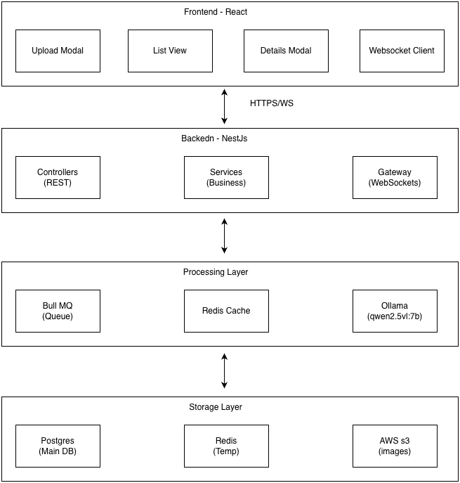

## Flow Diagram

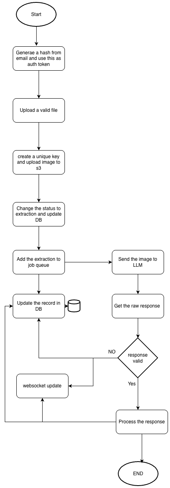

### Step-by-Step Installation

## Prerequisites

- Node.js 18+ and npm
- Docker & docker-compose
- PostgreSQL (local or remote)
- AWS credentials (for S3) or local S3-compatible service
- Ollama model (qwen2.5vl:7b) for image → structured data

### 1. Start Infrastructure Services

```bash
# Start Redis and ollama service
docker-compose up -d

# Verify services are running
docker-compose ps
```

### 2. Setup Ollama and Pull LLaVA Model

```bash
# Install qwen
docker exec ollama-vision ollama pull qwen2.5vl:7b
```

### 3. Setup Backend

#### 4.1 Install Dependencies

```bash
cd backend
npm install
```

#### 4.2 Configure Environment

```bash
nano .env
```

Required environment variables:

```env

# Server Configuration
PORT=3000
NODE_ENV=development

# Database
DATABASE_URL= <Postgres URL>

# Redis
REDIS_HOST=localhost
REDIS_PORT=6379

# AWS S3
AWS_REGION=eu-north-1
AWS_ACCESS_KEY_ID=<AWS_KEY>
AWS_SECRET_ACCESS_KEY=<ACCESS_SECRET>

# Ollama
OLLAMA_HOST=http://localhost:11434
OLLAMA_MODEL=qwen2.5vl:7b

# CORS
CORS_ORIGIN=http://localhost:5173

# frontend/.env.example
VITE_API_URL=http://localhost:3000
VITE_WS_URL=ws://localhost:3000

```

#### 4.3 Run Database Migrations

```bash
# Generate initial migration (if needed)
npm npx prisma generate

```

#### 4.4 Start Backend Server

```bash
# Development mode (with hot reload)
npm run start:dev
```

Backend should now be running at `http://localhost:3000`

It also exposes a queeue monitoring dashboard at `http://localhost:3000/queues`

### 5. Setup Frontend

#### 5.1 Install Dependencies

```bash
cd frontend
npm install
```

#### 5.3 Start Frontend Server

```bash
# Development mode
npm run dev
```

Frontend should now be running at `http://localhost:5173`

## Running Tests

### Backend Tests

```bash
cd backend

# Unit tests
npm run test

# E2E tests
npm run test:e2e

```

### Frontend Tests

```bash
cd frontend

# Run tests
npm run test
```

## Troubleshooting

- Redis connection errors: verify docker service `redis` or your host/port.
- Bull worker not processing: confirm the processor class has `@Processor('extraction')` and process method is decorated `@Process('process-receipt')`.
- Queues missing in Bull Board: check AppModule import ordering (queues must be registered before BullBoard).
- Ollama timeouts: ensure Ollama service is healthy and model is pulled.

## Project TODO / Improvements

- Persist raw LLM responses for traceability
- Improve model configuration (prompt/params) and graceful shutdown of LLM connections
- Add Playwright/Cypress E2E tests for the full flow
- Optional: Support pluggable LLM backends and model choice

## Sample Flow

1. Initial email form for Auth mimic
   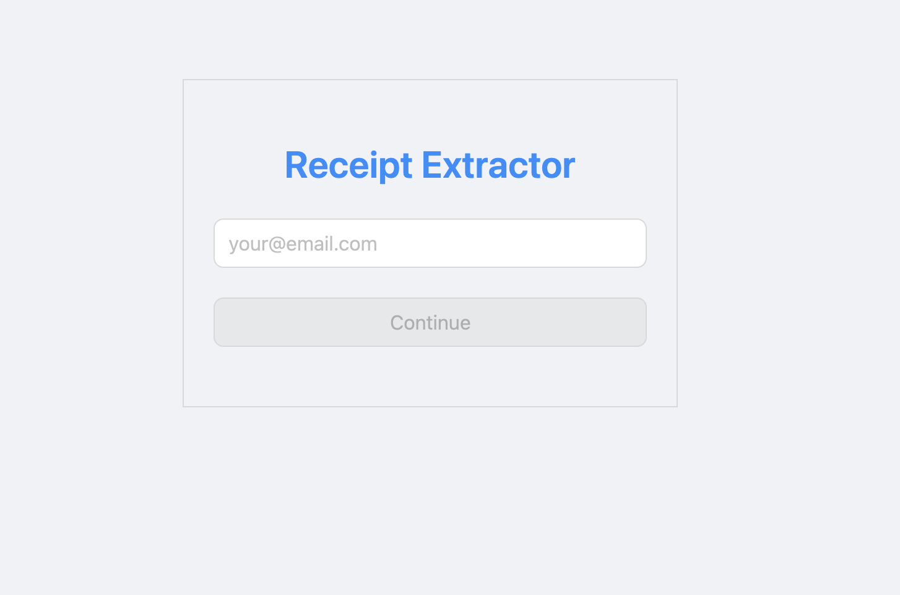

2. Form with valid email
   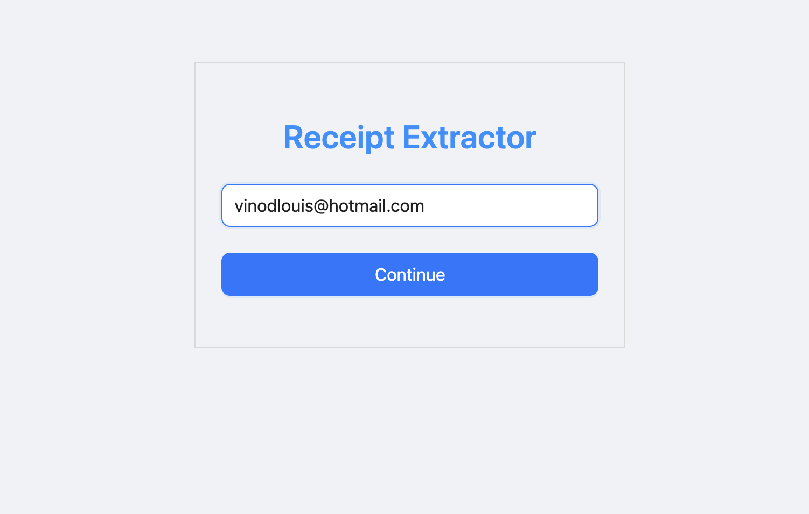

3. Initial landing screen
   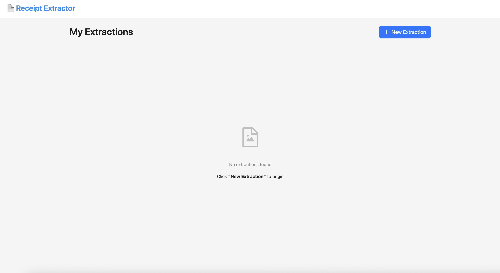

4. Add new extraction
   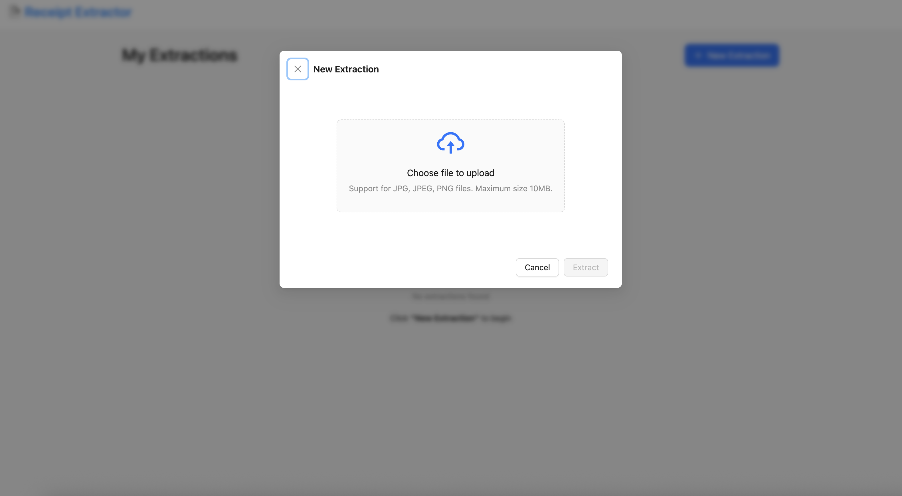

5. Image uploaded invalid
   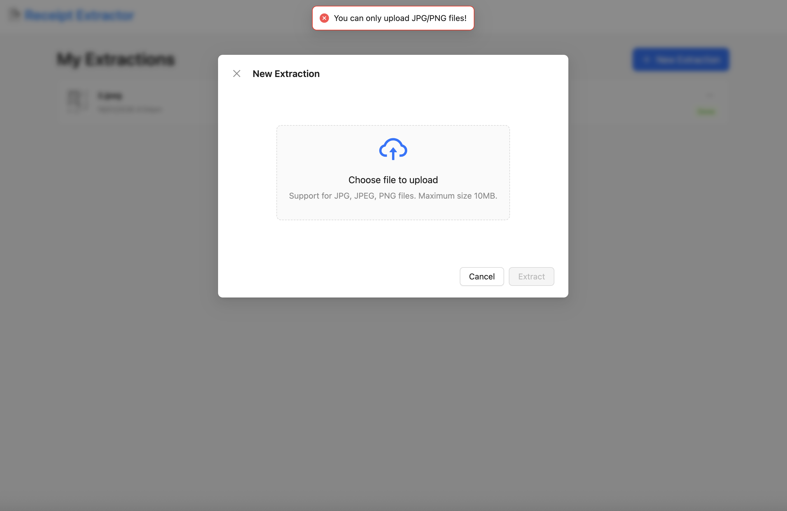

6. Image uploaded
   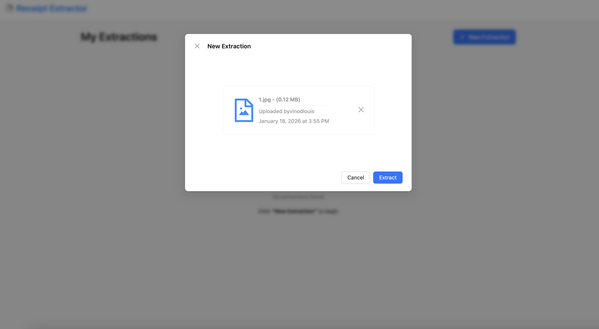

7. List while Extraction in progress
   

8. Modal while Extraction in progress
   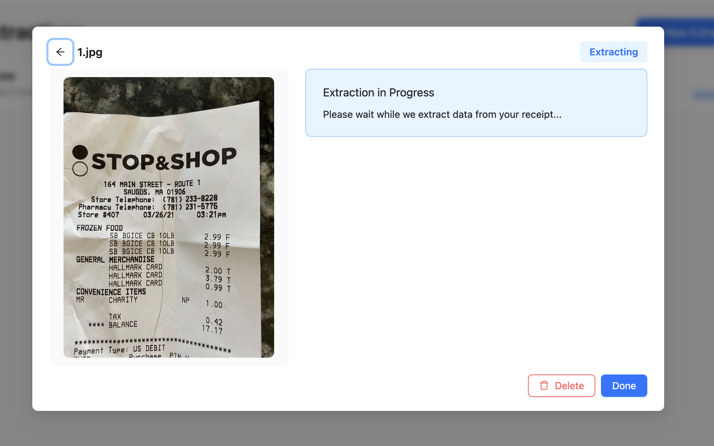

9. Real time updates
   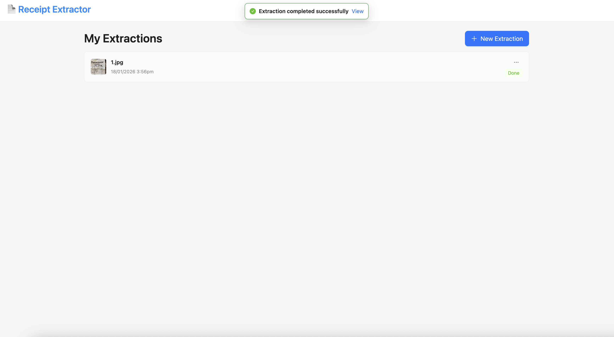

10. Extracted successful response
    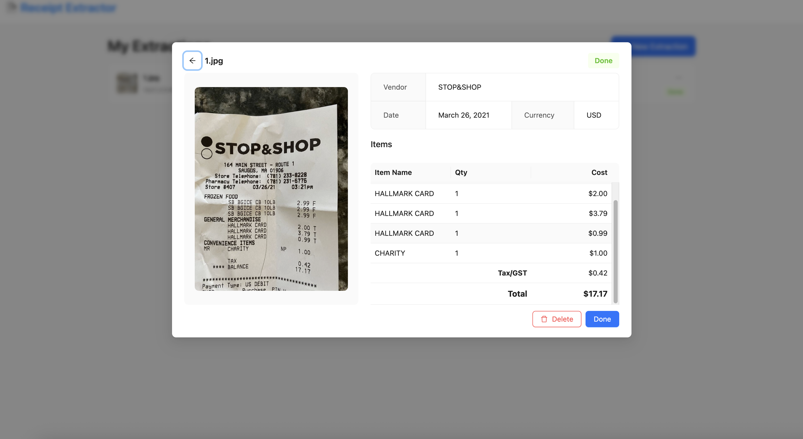

11. Delete Option
    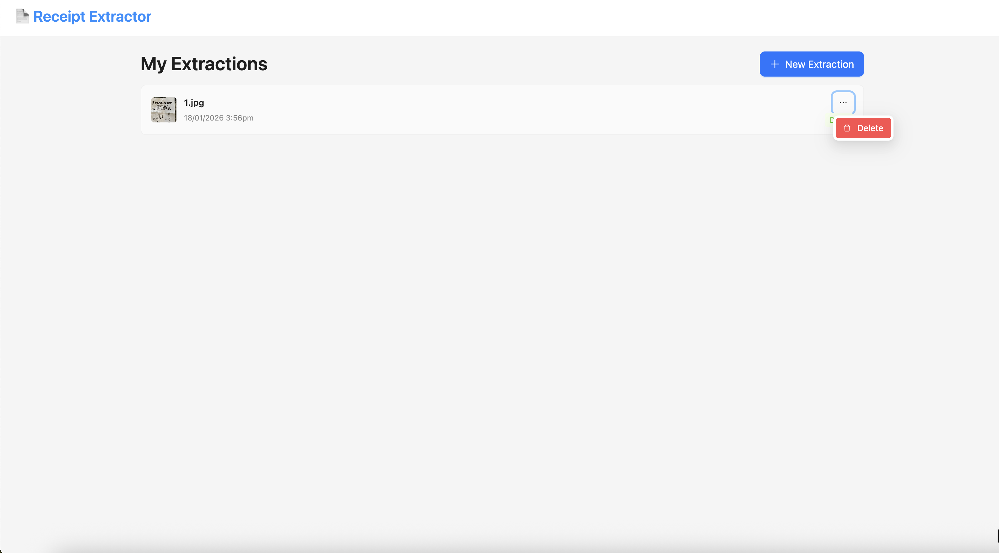

12. Delete Confirm
    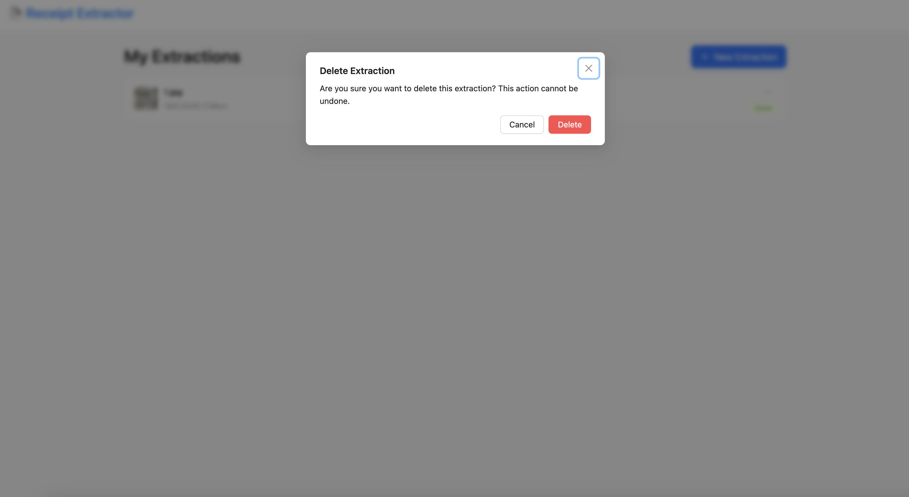

13. Invalid image
    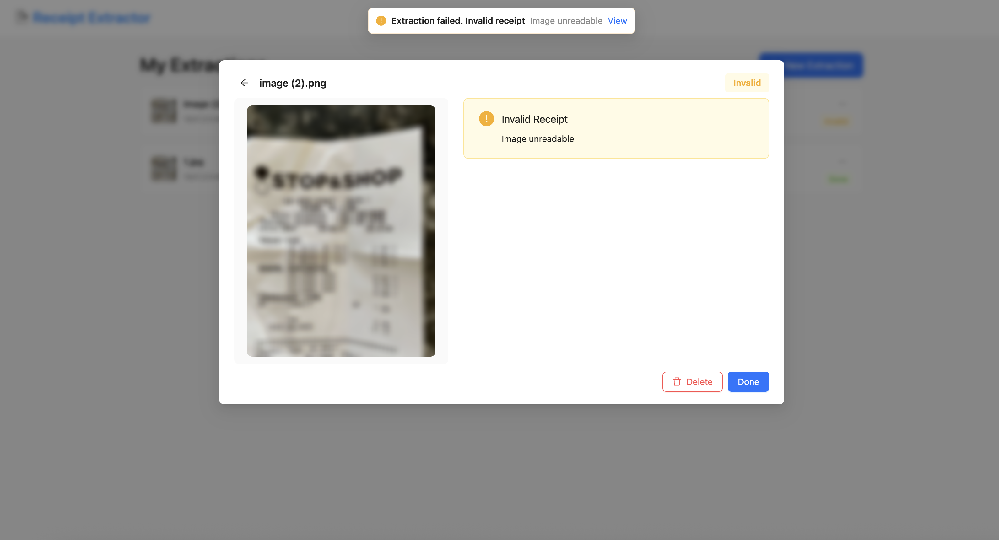

---

License

- MIT
